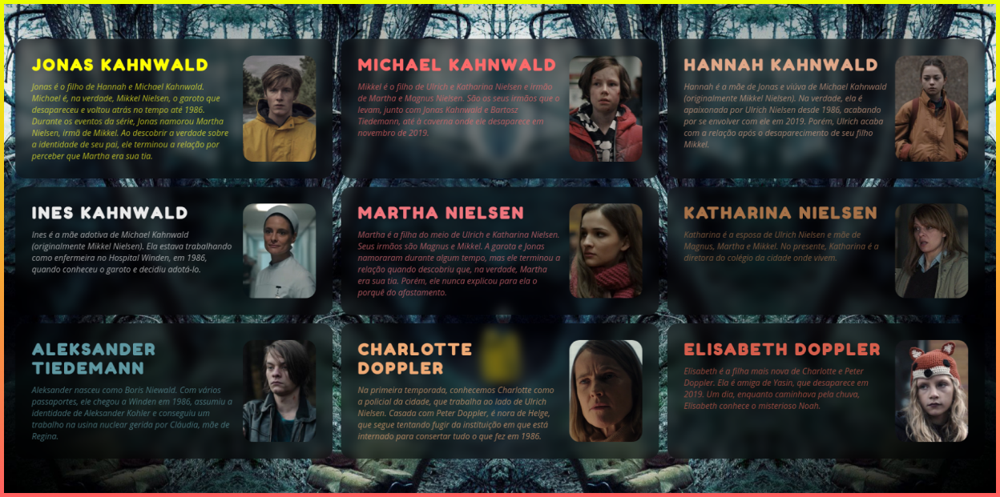
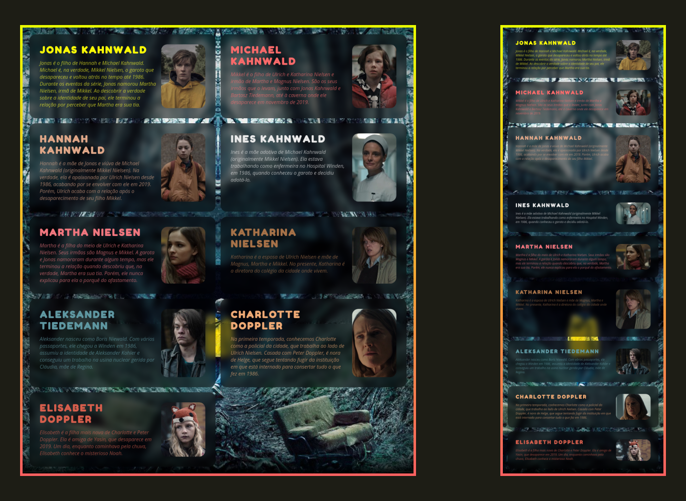

<!-- @format -->

# Personagens da série Dark

Acesse o projeto [aqui](https://vitorsemidio-dev.github.io/cards-personagens-dark/).

Página simples html com informações de alguns personagens da famosa série **Dark** _disponível na Netflix_.

## Resumo da série

Dark é uma série sobre viagens no tempo - e daí vem grande parte da complexidade da trama: o público acompanha tudo o que aconteceu na pequena cidade fictícia de Winden, na Alemanha, principalmente nos anos de 1953, 1986 e 2019 (ou seja, em pontos-chave de dois ciclos de exatamente 33 anos cada). Os acontecimentos não são mostrados de forma linear ou cronológica; e os personagens aparecem em diferentes fases da suas vidas: crianças, adultos e idosos

## Imagem do projeto

